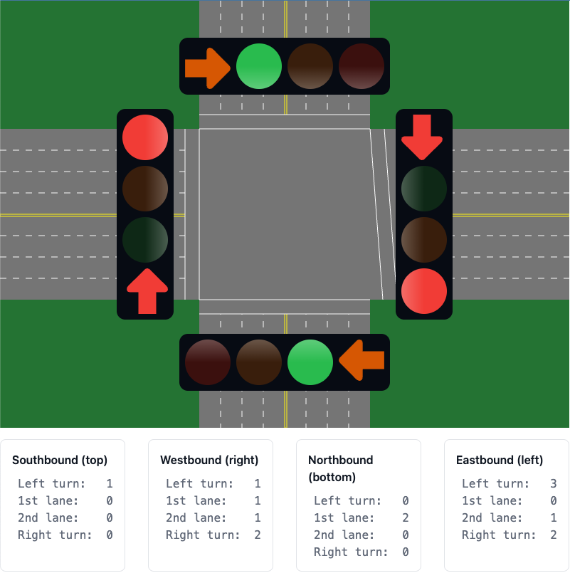

# Intersection Traffic Light Simulation

This project is a simulation of an intersection and the traffic light controllers. Each road on the intersection has 4 lanes, one lane dedicated for left turns, one for right turns, and two for proceeding straight. The application manages traffic lights and simulates vehicle arrivals and departures at an intersection. The simulation is written in React, with Vite, Vitest, and TailwindCSS.

You can view a live preview [here](https://eclopez.github.io/traffic-intersection).

## Installation

1. Clone the repository
2. Run `npm install` to install the dependencies
3. Run `npm run dev` to start the development server
4. The site will be running at [http://localhost:5173/](http://localhost:5173/)
5. The simulation will run automatically

## Architecture

The project structure is simple. Configuration and build files reside at the top level, along with the `index.html` and `main.css`. Inside the `src/` directory, are the `main.tsx` which is the entry point for the React application and the main component, `App.tsx`. The components and hooks are separated into the `components/` and `hooks/` directories respectively. Each component and hook has it's own folder, along with an `index.ts` file to export the component or hook. This is mostly for convenience, so that the `import` statements don't repeat the component or hook name, e.g. `import { TrafficLight } from './components/TrafficLight/TrafficLight'`.

There are 4 components in the simulation:

- `Vehicles`: For a specific travel direction on each road, tracks the number of cars in each lane provided by the `useTrafficPatterns` hook. When the relevant light changes, the component models the flow of traffic by decrementing the number of cars waiting in each lane.
- `TrafficLight`: Models one of the four specific traffic lights controlling the flow of traffic in the intersection.
- `Intersection`: The component that displays the vehicles and traffic lights, passing props to those components provided by the `useTrafficController` hook.
- `Scene`: Provides an immersive backdrop drawn on a `canvas` element.

There are 2 hooks in the simulation:

- `useTrafficController`: Manages the state of the traffic lights using a simple state machine to ensure that the transition between states is valid. Also manages the timing between these states.
- `useTrafficPatterns`: Returns the number of stopped vehicles for a given lane, along with functions to update the number of vehicles in each lane.

## Testing

To run all the tests once, run `npm run test`. To run the tests in watch mode, run `npm run test:watch`.
